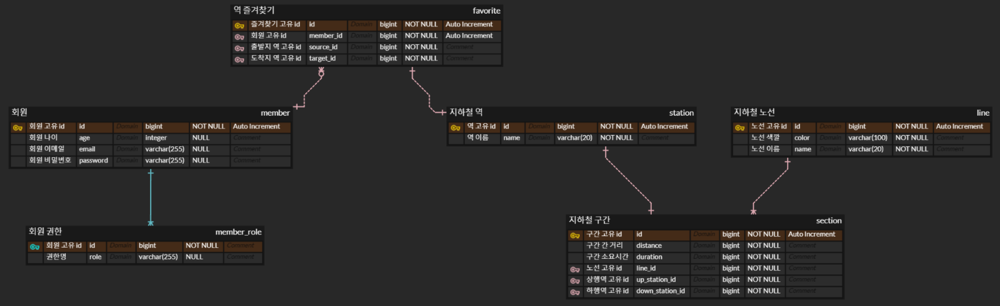

## NEXTSTEP ATDD 과정
> https://edu.nextstep.camp/c/R89PYi5H

### 과정 요약
- 인수 테스트 및 통합/단위 테스트를 통해 복잡하게 얽혀있는 로직을 안전하게 리팩토링하는 역량을 키웠던 피드백 중심의 멘토링 과정

### 수강 목적
- 복잡한 비즈니스 로직에서도 코드를 깔끔하게 유지하는 역량을 키우고 싶었습니다.
- Mock 없는 테스트를 통해 테스트의 신뢰도를 높일 수 있는 전략을 학습하고 싶었습니다.
- 블랙박스 테스트를 통해 레거시 코드를 안전하고 효율적으로 리팩토링하는 역량을 키우고 싶었습니다.

### 학습한 내용
- 인수 테스트와 통합/단위 테스트 등 다양한 테스트 전략 학습
- 복잡한 비즈니스 로직을 읽기 쉬운 코드로 안전하게 리팩토링하는 역량 트레이닝
- Spring Rest Docs를 이용한 Presentation Layer 테스트 기반의 API 문서 자동화 학습

### 내용 정리
- [NEXTSTEP ATDD 총 정리 - 6주간의 기록](https://velog.io/@beomdrive/NEXTSTEP-ATDD-Final)
- [NEXTSTEP 주차별 회고](https://velog.io/@beomdrive?tag=NEXTSTEP)

### PR 바로가기
- 1차 과제 리뷰
  - [Step-1](https://github.com/next-step/atdd-subway-map/pull/604), [Step-2](https://github.com/next-step/atdd-subway-map/pull/685), [Step-3](https://github.com/next-step/atdd-subway-map/pull/710)
- 2차 과제 리뷰
  - [Step-1](https://github.com/next-step/atdd-subway-path/pull/481), [Step-2](https://github.com/next-step/atdd-subway-path/pull/514), [Step-3](https://github.com/next-step/atdd-subway-path/pull/525)
- 3차 과제 리뷰
  - [Step-1](https://github.com/next-step/atdd-subway-favorite/pull/413), [Step-2](https://github.com/next-step/atdd-subway-favorite/pull/440), [Step-3](https://github.com/next-step/atdd-subway-favorite/pull/451)
- 4차 과제 리뷰
  - [Step-0](https://github.com/next-step/atdd-subway-fare/pull/320), [Step-1](https://github.com/next-step/atdd-subway-fare/pull/331), [Step-2](https://github.com/next-step/atdd-subway-fare/pull/333), [Step-3](https://github.com/next-step/atdd-subway-fare/pull/337)

---

### 미션 관련 ERD
- ERD Cloud - https://www.erdcloud.com/d/tquYyrSeEHaqpZThG

### 미션 정리

1차 과제 미션

     

### STEP 1
- [x] 지하철역 목록 조회 인수 테스트 작성하기
- [x] 지하철역 삭제 인수 테스트 작성하기

### STEP 2
- [x] 지하철 노선 생성하기
  - [x] 노선 생성 시 들어온 역 정보들을 상행종점역과 하행종점역으로 등록하기
- [x] 지하철 노선 목록 조회하기
- [x] 지하철 노선 조회하기
- [x] 지하철 노선 수정하기
- [x] 지하철 노선 삭제하기
- [x] 인수 테스트 격리하기

### STEP 3
- [x] 지하철 구간 등록하기
  - [x] 새로운 구간의 상행역은 해당 노선에 등록되어있는 하행 종점역이어야 한다.
  - [x] 새로운 구간의 하행역은 해당 노선에 등록되어있는 역일 수 없다.
- [x] 구간을 제거한다.
  - [x] 지하철 노선에 등록된 역(하행 종점역)만 제거할 수 있다. 즉, 마지막 구간만 제거할 수 있다.
  - [x] 지하철 노선에 상행 종점역과 하행 종점역만 있는 경우(구간이 1개인 경우) 역을 삭제할 수 없다.

2차 과제 미션

### STEP 1
- [x]  구간 추가 제약사항 변경
    - [x]  기존에는 마지막 역을 기준으로만 구간 추가 →  위치와 상관 없이 추가 가능
    - [x]  새로운 역을 상행 종점으로 등록할 경우 맨 상위 구간으로 추가
    - [x]  새로운 역을 하행 종점으로 등록할 경우 맨 하위 구간으로 추가
    - [x]  사이에 끼울 경우 각 기존 구간의 상행역 or 하행역을 신규 구간 정보로 잘 변경
    - [x]  노선 조회 시 상행 좀점을 기준으로 역들이 잘 정렬되어 반환
- [x]  구간 추가 예외
    - [x]  상행역과 하행역 둘 중 하나도 포함되어있지 않으면 추가 불가
    - [x]  상행역과 하행역이 이미 노선에 모두 등록되어 있다면 추가 불가
    - [x]  역 사이에 새로운 역을 등록할 경우 기존 역 사이 길이보다 크거나 같으면 추가 불가

### STEP 2

- [x]  구간 삭제 제약 사항 변경
  - [x]  기존에는 마지막 역만 삭제 → 위치에 상관 없이 삭제 가능
  - [x]  종점이 제거될 경우 다음으로 오던 역이 종점이 되도록 구현
  - [x]  중간역이 제거될 경우 재배치
    - A - B - C 구간에서 B 제거 → A - C 로 재배치
    - 거리는 두 구간의 거리의 합 (A-B 거리 + B-C 거리)
- [x]  구간 삭제 예외
  - [x]  노선에 등록되어 있지 않은 역은 제거 불가
  - [x]  구간이 하나인 노선에서 구간 제거 불가

### STEP 3

- [x] 경로 조회 기능
  - [x] 출발역 id와 도착역 id로 요청하면 출발역 <-> 도착역까지의 경로에 있는 역 목록이 검색됨 (stations)
  - [x] 조회한 경로 구간의 총 거리 (distance)
- [x] 경로 조회 예외
  - [x] 출발역과 도착역이 같은 경우
  - [x] 출발역과 도착역이 연결이 되어 있지 않은 경우
  - [x] 존재하지 않은 출발역이나 도착역을 조회할 경우

3차 과제 미션

     

### STEP 1
- [x] 로그인
  - [x] 토큰 생성 API
    - 아이디와 패스워드를 이용하여 토큰 생성
  - [x] 내 정보 조회 API
    - 로그인 시 생성된 토큰을 이용하여 내 정보 조회

### STEP 2
- [x] GitHub 로그인 검증 인수 테스트
- [x] Github를 이용한 로그인 구현 (토큰 발행)
- [x] 가입이 되어있지 않은 경우 회원 가입으로 진행 후 토큰 발행

### STEP 3
- [x] 경로 즐겨 찾기
  - [x] 즐겨 찾기 생성
  - [x] 즐겨 찾기 조회
  - [x] 즐겨 찾기 삭제
  - [x] 내 정보 관리 / 즐겨 찾기 기능은 로그인 된 상태에서만 가능
- [x] 예외
  - [x] 비로그인이거나 유효하지 않을 경우 401 Unauthorized 응답

4차 과제 미션

     

### STEP 0
- [x] 경로 조회 기능 문서화

### STEP 1
- [x] 구간 추가 시 소요시간 정보도 추가하도록 변경
- [x] 구간 삭제 시 소요시간 정보도 합쳐지도록 변경
- [x] 노선 추가 시 소요시간 정보도 추가하도록 변경
- [x] 경로 조회 타입 추가
  - [x] 인수 테스트 수정
  - [x] 문서화
  - [x] 기능 구현
    - [x] 소요 시간으로 가중치를 측정하는 메서드 추가
    - [x] 타입에 맞게 조회 메서드를 사용하도록 변경

### STEP 2
- [x] 최단 거리 경로 조회 응답 결과에 요금 정보 추가
  - [x] 인수 테스트 수정
  - [x] 문서화 테스트에 응답 결과 수정
  - [x] 요금 계산 메서드 TDD (단위 테스트)
  - [x] 요금 조회 리팩토링

   

  ##### 요금 계산
  > distance 기본 단위를 km로 진행

  - 기본거리(10km 이내) : 기본운임 1250원
  - 이용 거리 초과 시 추가 운임 부과
    - 10km초과~50km까지 : 5km마다 100원 추가
    - 50km 초과 시 : 8km마다 100원 추가

### STEP 3
- [x] 노선별 추가 요금
  - [x] 노선 생성 시 추가 요금 정보 추가
  - [x] 요금 계산 시 추가 요금 반영
- [x] 연령별 요금 할인
  - [x] 로그인 된 사용자가 경로 조회를 할 경우 age 값 기준으로 할인 요금 계산

   

  ##### 노선별 추가 요금
  - 신분당선 같이 추가 요금이 있는 노선을 이용할 경우 측정 된 요금 + {추가 요금} 계산
    - 노선별 추가 요금 정보 추가 (노선 생성 시)
    - 추가 요금이 있는 노선으로 환승하여 이용할 경우 가장 높은 금액의 추가 요금만 적용
      - ex) `0원`, `500원`, `900원`의 추가 요금이 있는 노선들을 환승할 경우 `1250원 + {기본 거리 초과액} + 900원`으로 계산
    - `1250원 + {기본 거리 초과액}`는 기존 계산 메서드 그대로 사용 후 추가 요금 반영

  ##### 로그인 사용자의 경우 연령별 요금으로 계산
  - 청소년 (13세 이상 ~ 19세 미만) : 운임 요금에서 350원 공제한 금액의 20% 할인
    - `(운임 요금 - 350원) * 0.8`
  - 어린이 (6세 이상 ~ 13세 미만) : 운임 요금에서 350원 공제한 금액의 50% 할인
    - `(운임 요금 - 350원) * 0.5`
  - 어린이 (6세 미만) : 무료
    - 개인적인 추가 요구 사항

